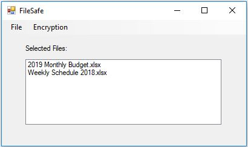
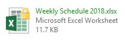

# FileSafe
A Windows file encryption and decryption application.

[Why can I still read the file?](https://security.stackexchange.com/questions/51486/what-does-windowss-built-in-encryption-do-if-i-can-seemingly-always-read-my-en)
